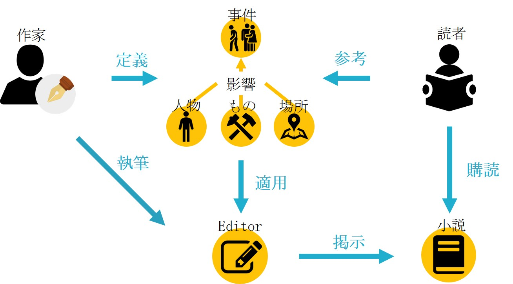
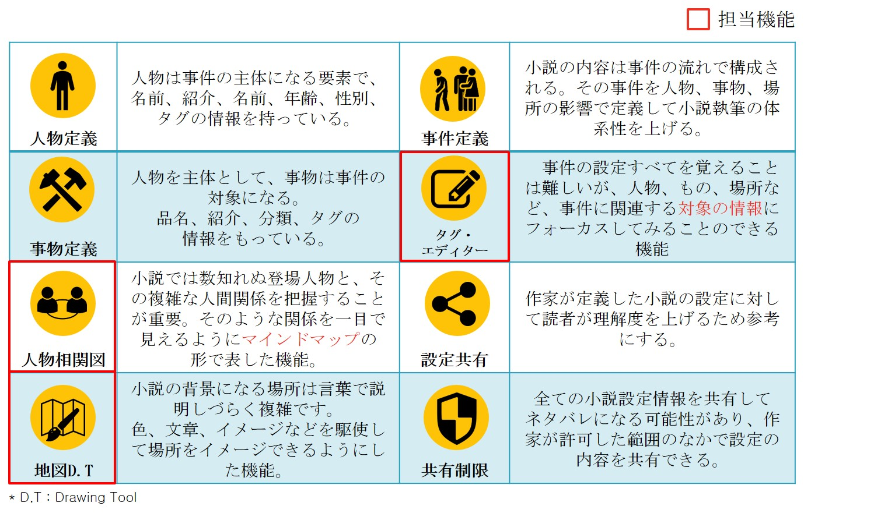

プロジェクト名｜
作家の部屋 http://sakkanoheya.com/ 

開発期間 / 開発人員｜
2017. 5. 16 ~ 2017. 8. 25( ３ヶ月 ) 　/　 6人

開発環境｜
Laravel(PHP MVCFramwork), JavaScript, jQuery, D3.js,
 	       HTML5, CSS3, Bootstrap

概要｜
アマチュア小説作家の執筆を手伝うヘルパーツールを備えている
小説共有サイト。 
小説の内容は多数の事件で構成され、事件は「人物、事物、場所」の影響で作られる。このサービスでは背景設定部分で事件を定義し、事件に基づいて執筆部分で小説の内容を作成。

担当 
1. 背景設定部分の人物相関図（ D3.js ) 
<a src='https://github.com/daegunkor/sakkanoheya/blob/master/app/Http/Controllers/RelationController.php'>CONTROLLER : app/Http/Controllers/RelationController.php</a> 
<a src='https://github.com/daegunkor/sakkanoheya/tree/master/resources/views/background/relationship'>VIEW : resources/views/background/relationship</a>

2. 地図作成ツール（ D3.js ) 
<a src='https://github.com/daegunkor/sakkanoheya/blob/master/app/Http/Controllers/MapController.php'>CONTROLLER : app/Http/Controllers/MapController.php</a> 
<a src='https://github.com/daegunkor/sakkanoheya/tree/master/resources/views/background/map'>VIEW : resources/views/background/map</a>

3. 執筆部分のエディター  ( jQuery ) 
<a src='https://github.com/daegunkor/sakkanoheya/blob/master/app/Http/Controllers/writeNovelController.php'>CONTROLLER : app/Http/Controllers/writeNovelController.php</a> 
<a src='https://github.com/daegunkor/sakkanoheya/tree/master/resources/views/write_novel'>VIEW : resources/views/write_novel</a>

サービスの流れ

主なサービス

